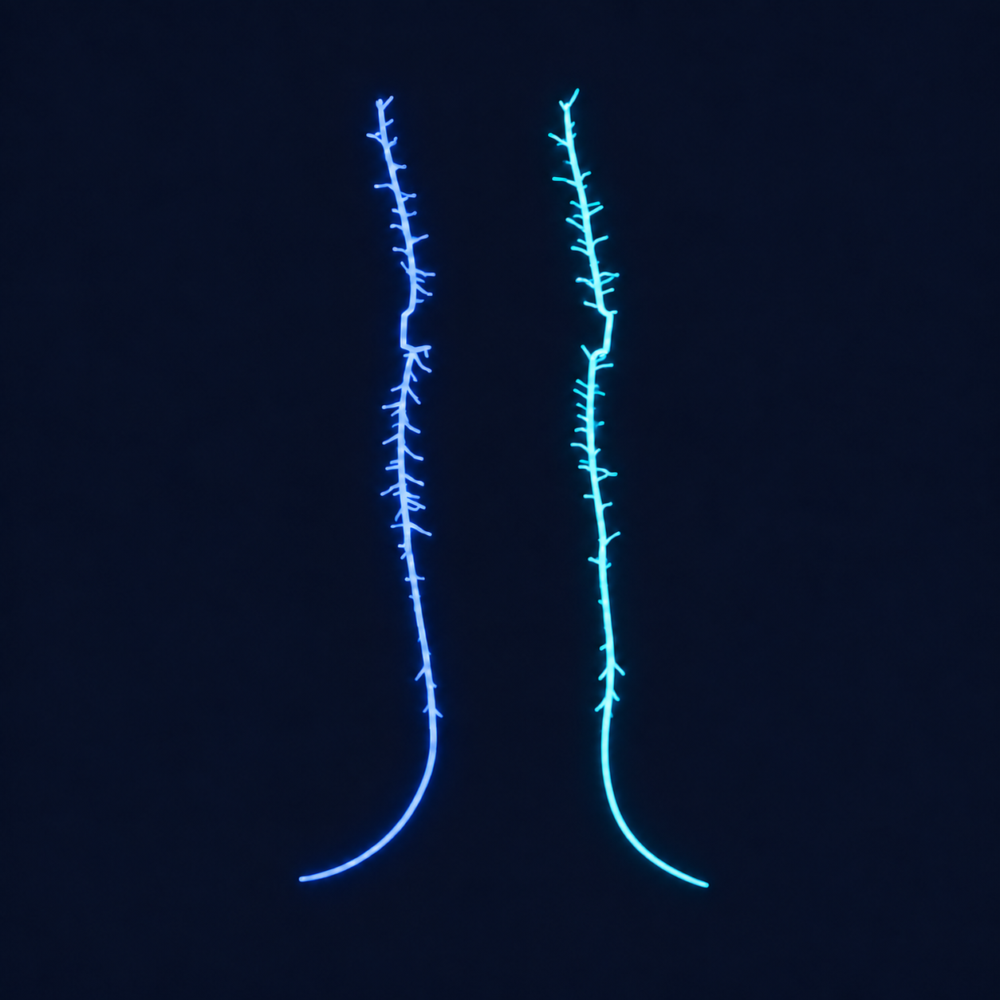

# Digifly Workstation

<p align="center">
  
</p>

Digifly Workstation is a standalone desktop application for configuring, validating,
running, and reviewing Digifly experiments. It does not modify Digifly's source
code or imported datasets. It uses its own local workspace and can optionally
link an existing legacy Digifly source tree. Circuit Builder owns morphology,
connectivity, and biophysics; the notebook-independent Experiment Builder owns
stimuli, runtime manipulations, timing, recording, and compute controls. Generic
execution remains gated until each requested mechanism and mapping passes an
adapter's capability and comparison checks. The executable generic subset runs
supported morphology-backed classic-HH selected cell sets in Arbor or NEURON
with imported chemical and validated electrical contacts. A bounded BMTK
BioNet/SONATA lane runs morphology-backed classic-HH cells with selected
chemical contacts, soma current clamps, soma voltage, and spikes. Every run
saves complete app-owned provenance and canonical result artifacts.

The app has a backend-unbound Circuit Builder preview. It discovers local SWC
roots, selects morphologies by neuron ID or path-derived type/family, renders
soma-point or full-skeleton representations, and stores a classic-HH draft plus
stable SWC child-node selections. It now also preserves exact native Phase 2 Na/K/Ca mechanism
identities, regional conductance densities, and separate chemical-synapse and
gap-junction edge policies. General selected-subgraph chemical execution is
available for the indexed local MANC source; electrical execution uses the
manifest-validated local gap-contact scope. Unsupported edge sources and native
channel catalogues remain fail-closed; BMTK also rejects electrical contacts,
non-soma/per-compartment mapping, MPI, PointNet, and DPointNet requests rather
than silently omitting them. The generic adapter writes a schema-v2 run-owned manifest
of every selected contact and its effective model parameters.
The dormant Escape-SIZ
NEURON and Arbor adapters remain available as
versioned scientific backends and provenance references, but Escape-SIZ is no
longer an application tab or project model.

## Early tester quick start

This is a private alpha. Invited collaborators are authorized by Digifly to
clone and run this repository solely for private evaluation and feedback. That
authorization does not permit redistribution, publication, sublicensing, or
production use of the source or a built application.

Download the current Apple-silicon Mac build from
[Digifly Workstation 0.1.0 alpha 1](https://github.com/Saint-Sam/Digifly-Application/releases/tag/v0.1.0-alpha.1):

1. Download `Digifly-Workstation-0.1.0-alpha.1-macOS-arm64.zip` from the
   release's **Assets** section.
2. Unzip it, then right-click **Digifly Workstation** and choose **Open**.
3. Confirm **Open** when macOS warns that the developer cannot be verified.
   If macOS still blocks it, approve the app in **System Settings → Privacy &
   Security**, then open it again.

The application contains its own interface runtime; testers do not need to
install Python or build the source. No connectome, SWC collection, API token,
or simulator installation is required for the base interface smoke test.
Scientific resources remain outside the application and are configured through
the first-launch workflow. Follow the short, audited [early-testing
flow](docs/TESTING.md) before filing a report.

## What the first milestone includes

- A native Qt desktop interface for macOS, Windows, and Linux.
- Workspace discovery for NEURON, Arbor, BMTK, and VND assets.
- A Circuit Builder preview with Arbor as its default saved intent and selectors
  for NEURON or BMTK adapter targets. Each engine creates a capability-gated
  runnable plan for its implemented subset.
- A notebook-independent Experiment Builder that receives a read-only
  `CircuitSpec` snapshot and serializes simulation timing, pulse protocols,
  conditions, ablations, runtime mechanism scales, recordings, seeds,
  repetitions, and worker allocation in a separate `ExperimentSpec`.
- Real, cancellable Arbor, NEURON, and bounded BMTK BioNet classic-HH run paths
  for supported selected circuits,
  including engine preflight, normalized-name collision protection, immutable
  request documents, run/job manifests, stdout capture, soma voltage CSV,
  threshold-crossing spike CSV, optional PNG, and automatic Results handoff.
  Arbor and NEURON runs write a parent-before-child SWC and source-to-run node
  map inside the run folder so both receive the same validated topology. Arbor's
  explicit segment-tree conversion additionally records a sub-resolution root
  stub because Arbor cannot simulate a zero-length SWC root; the source is
  never modified.
- General selected-cell Arbor and NEURON network lanes. They extract only selected-to-
  selected rows from the external indexed MANC cache, preserve each imported
  chemical contact as an `Exp2Syn` site, map every chemical and electrical
  endpoint through run-owned SWC node maps, and independently apply chemical
  and gap condition switches. The connectome data remain outside the package.
- A bounded BMTK BioNet lane that emits run-owned SONATA nodes, selected
  chemical edges and biological-ID crosswalks, then preserves native BioNet
  soma-voltage/spike reports alongside canonical Digifly CSV and summary
  artifacts. BMTK, NEURON, NumPy, and `h5py` must coexist in the selected external
  interpreter. Electrical edges, native membrane mechanisms, non-soma or
  per-compartment stimulation/recording, MPI, PointNet, and DPointNet fail
  closed in this lane.
- Male-CNS v0.9 uses the same run-owned chemical manifest without importing its
  7.8 GB Parquet table. A packaged streaming query helper runs in the selected
  scientific Python (which must provide DuckDB), converts source nanometers to
  SWC micrometers, and copies only selected-to-selected contacts plus their
  confidence and neurotransmitter annotations.
- An explicit chemical-synapse policy records fallback weight, weight scaling,
  delay or geometric-delay parameters, `Exp2Syn` rise/decay constants,
  reversal potential, and presynaptic spike threshold. Run manifests mark each
  effective parameter as connectome-sourced or circuit-policy-sourced.
- Local SWC-source discovery and neuron queries by ID, type, or family, such as
  `10000, 10002`, `type:GFC2`, `family:DN`, and `all:IN`.
- A default one-marker-per-neuron soma overview with an obvious **Soma points** /
  **Full skeletons** toggle. The batched OpenGL skeleton view adds whole-neuron
  isolation and multi-segment selection by SWC child-node ID.
- Editable cell-set-, neuron-, and SWC-segment classic-HH drafts, including Na,
  K, and Ca reversal potentials, which remain capability-gated until an
  execution adapter validates them.
- A versioned catalog for the three Augustin-2019 GF mechanisms and all eight
  native Phase 2 membrane surrogates. The exact GF set is `nat`, `nap`, and `k`;
  the Phase 2 set is
  `na16a`, `na14a`, `kv14sh`, `kv42shal`, `kv21shab`, `kv31shaw`,
  `cav21cac`, and `cav31t`. Saved assignments include a stable catalog ID,
  source-relative path, and SHA-256 of the exact `.mod` source.
- A named **Augustin 2019 GF (exact)** profile keeps ELeak −85 mV, ENa +65 mV,
  EK −74 mV, the three published conductances, 25 °C, and −65 mV initialization
  together. It reports the model's predicted zero-current equilibrium separately
  (−74.670 mV); initialization is not labeled as rest. Classic-HH, Phase 2
  Para+Shab, Phase 2 channel-family, and Escape-SIZ Para+HH-K profiles remain
  available, plus fully custom multi-channel stacks with separate soma
  and branch densities. A named profile applies its HH and native-channel values
  atomically; editing either half marks it Custom.
- Selected-neuron, selected-SWC-segment, cell-set-default, and explicit
  all-loaded-neuron mass-apply actions. More-specific saved segment overrides
  remain intact when a broader neuron assignment is applied.
- Separate all-electrical-edge policies for native `Gap`, `RectGap`, and
  `HeteroRectGap` intent, including placement and per-site versus pair-total
  conductance semantics, exact source hashes, and endpoint-role labels.
  Pair-total conductance is explicitly divided equally over selected sites;
  no GJ is attached until a two-endpoint connectivity source is loaded.
- Non-destructive reusable morphology bundles containing an unchanged SWC,
  biophysics sidecar, provenance manifest, and SHA-256 identity.
- An app-owned pulse-train comparison template translated from useful Escape-SIZ
  runtime controls without importing or executing a notebook.
- A dedicated Arbor 0.12.2 adapter for the locked 49-cell Escape-SIZ Ablation
  comparison, with paired gap-enabled/gap-disabled plans and app-owned outputs.
- App-owned Arbor NMODL sources for `Gap`, `RectGap`, and `HeteroRectGap`, plus
  a fail-closed worker bridge that loads the compiled catalogue under the
  `digifly_` prefix and never substitutes Arbor's built-in `gj`.
- Byte-locked app-owned NEURON copies of `Gap`, `RectGap`, and `HeteroRectGap`,
  with an isolated builder that selects the configured runtime's `nrnivmodl`,
  load-probes the compiled library, and reuses only a version/hash-valid cache.
- Explicit separation of build-time and runtime-safe controls.
- Cache, contact-policy, environment, disk, and output preflight checks.
- Exact command preview with no shell interpolation.
- Streamed run logs and a guarded simulation launch.
- Read-only loading and validation of completed Escape-SIZ summaries and plots.
- A versioned `.digifly.json` project format and adapter-oriented architecture.

## Developer setup: run from source

This section is for contributors modifying Digifly. Testers should use the
downloadable application above. The development UI uses its own environment so
simulator environments remain isolated. Create that environment once:

```bash
cd "/path/to/Digifly Workstation"
./scripts/setup_dev.sh
./scripts/run_dev.sh
```

The equivalent manual setup is:

```bash
python3 -m venv .venv
source .venv/bin/activate
python -m pip install -e ".[test]"
digifly-workstation
```

## Maintainer-only macOS build

`dist/Digifly Workstation.app` is generated locally, ignored by Git, and is not
part of an early tester's repository checkout. This section is for maintainers
or testers who receive a build directly from a maintainer; everyone else should
use the source launch above. Double-click the supplied app in Finder. New
projects default to
`~/Digifly Workstation Workspace`, keeping large caches and simulation recordings
outside both the application bundle and `Digifly Public`.

The current bundle is ad-hoc signed for local testing. A public download still
needs an Apple Developer ID signature and notarization. Rebuild instructions
are in [docs/DEPLOYMENT.md](docs/DEPLOYMENT.md).

Run the non-GUI workspace check with:

```bash
PYTHONPATH=src .venv/bin/python -m digifly_app.cli doctor \
  --workspace "/path/to/Digifly Public"
```

Create a machine-local external-resource profile without copying datasets:

```bash
digifly-resources init \
  --workspace "/path/to/Digifly Public" \
  --output "$HOME/Digifly Workstation Workspace/runs" \
  --managed-data "$HOME/Digifly Workstation Workspace/data" \
  --neuron-python "/path/to/neuron/python" \
  --morphology "external-swcs=/path/to/SWC/root"
digifly-resources validate
digifly-doctor --profile "$HOME/Digifly Workstation Workspace/config/resources-v2.json"
```

Existing version-1 profiles load without modification. Write the current
version beside the preserved v1 file with:

```bash
digifly-resources migrate \
  --profile "$HOME/Digifly Workstation Workspace/config/resources-v1.json"
```

The **Data Library** page can copy a local folder through validated staging or
register an existing SWC folder read-only without copying it. Managed imports
receive a provenance/checksum manifest and an adaptive per-SWC quality audit
before atomic promotion.

**Download from neuPrint** provides the same managed path for remote neuron
SWCs. It accepts a password-masked pasted token, the standard
`NEUPRINT_APPLICATION_CREDENTIALS` environment variable, or an explicitly
saved operating-system credential; validates the connection; lists the live
datasets; and previews bounded selections by body ID, type, instance, or ROI.
Users choose the download and snapshot folder names and review the exact
destination before a cancellable staged download begins. Completed SWCs appear
in Circuit Builder and open in the existing post-import quality review. Users
can also include a bounded directed CSV of connections among the reviewed
neurons. Every completed SWC and connectivity table is checksummed into a
credential-free checkpoint, so cancellation or a network failure can resume
without redownloading verified files; the dialog can explicitly discard a
saved partial job. Tokens are never written to projects, profiles, manifests,
logs, checkpoints, or command previews.

**Import model / ModelDB** accepts an official ModelDB accession, a downloaded
ZIP/TAR archive, or an unpacked local model folder. It previews metadata and
the exact destination, rejects traversal paths, links, special files,
case-colliding names, excessive expansion, and configured size/file-count
limits, then copies or extracts the model through cancellable staging. The
registered source remains read-only and inert: intake never imports Python,
runs MATLAB/HOC, compiles NMODL, or launches a simulator. Model SWCs receive the
same adaptive post-import audit, and the original archive can be retained for
provenance. When a ModelDB record only links externally hosted code, Workstation
opens the official page and requires the user to select the downloaded archive
or folder instead of following an arbitrary external URL automatically.
The backend applies bounded transient-only retry to metadata and archives,
supports receipt-backed HTTP range resume when a caller reuses the download
destination, and refuses to overwrite an existing file.

Each Data Library row now exposes its registration state and selected-resource
controls. **Inspect manifest** shows human-readable provenance plus a bounded
read-only inventory preview; **Unregister** removes only profile bindings and
keeps every byte, retaining an inactive catalog record so legacy names and exact
prior bindings are not lost; **Register** reconnects that stored bundle without
recopying it. **Move to Library Trash** atomically unregisters and moves the
whole bundle into a recoverable `.trash` area. **Manage Trash** restores the
exact original location and previous bindings. If a user moves the whole data
library with Finder or another file manager, **Relink moved library** validates
every relocated managed path and manifest before changing the machine profile;
it never copies data or recreates a missing old root silently. **Move library**
performs the move itself: same-filesystem destinations use rollback-safe atomic
rename, while cross-filesystem destinations are copied and SHA-256 verified
before the profile changes and the source is removed. Trash remains recoverable
unless the user explicitly chooses **Permanently delete selected**, confirms the
irreversible deletion, and purges that exact receipt.

The Phase 3 backend interface is now frozen for UI work. Its stable entry
points, retry/error rules, transaction order, manifest invariants, and change
control are recorded in
[Backend contract v1](docs/BACKEND_CONTRACT_V1.md). New UI code must call those
interfaces instead of manipulating managed files, checkpoints, credentials, or
profiles directly.

The Workspace page keeps separate **NEURON Python**, **Arbor Python**, and
**BMTK/BioNet Python** choices. **Find or install simulator runtimes** links to
the official guides and offers a consent-gated, read-only search of PATH and
common Conda or virtual-environment locations. Discovery reads package metadata
in isolated child processes and saves only approved interpreter paths to the
machine-local resource profile. A BMTK choice is runnable only when BMTK,
NEURON, NumPy, and `h5py` import from that same selected interpreter; the app never
borrows a simulator module from inherited `PYTHONPATH` state.

Audit recent manifest-declared SWC imports without scanning large legacy
connectome trees, then optionally review radius-only repairs:

```bash
digifly-swc-quality scan
digifly-swc-quality review
```

The same review is available from Circuit Builder's **Check recent imports**
button. The detector is normalized independently for each SWC; it never assumes
that different neuron types or connectomes share one absolute radius. The
historical DNp01 repair and the copy/overwrite provenance contract are described
in [Post-import SWC quality](docs/SWC_IMPORT_QUALITY.md).

Run tests with:

```bash
PYTHONPATH=src .venv/bin/python -m pytest
```

## Circuit Builder controls

New cell sets open in **Soma points** mode in the orthographic VIP GLIA anatomy
orientation used by `Ablation Baseline and Na Response Match.ipynb`. The
adjacent **Soma points** / **Full skeletons** buttons switch representations at
any time. MANC DNs use Digifly's rostral type-1 pseudosoma convention, placing
their marker at the northern end of the reference view. Switching modes,
focusing a neuron, and `F` fit the camera to the active point or skeleton
representation; `R` also restores the reference orientation.

- Left-drag or `W/A/S/D`: rotate.
- Shift-left-drag, middle-drag, or arrow keys: pan.
- Mouse wheel: zoom.
- Right-click: center the picked neuron; right-double-click: restore all.
- In **Soma points**, left-click a marker to select and isolate that neuron.
- In **Full skeletons**, left-click a visible skeleton to select and isolate it.
- Left-click isolated skeleton segments: toggle individual SWC compartments;
  selected compartments are always electric magenta.
- Cmd/Ctrl+Shift-left-drag on an isolated neuron: draw a box that adds every
  intersecting compartment to the selection.
- `Escape` or `I`: restore/isolate; `F`: fit; `R`: reset view; `C`: clear
  segment selection.

Compartment selection and editing are available only in **Full skeletons**.
Existing compartment selections remain stored when switching to **Soma
points**, where they are hidden until the skeleton view is restored.

Readouts and guidance text wrap within the viewport card and support normal
mouse text selection plus the native right-click Copy menu. Large multi-neuron
views in **Full skeletons** use a connected topology-preserving preview only
during overview camera motion; deep zoom uses the exact morphology with
hierarchical off-screen culling. Settled skeleton rendering, picking, editing,
and exports always use the exact source geometry; the point overview does not
alter it.

The editor writes unchanged-SWC + biophysics bundles under
`~/Digifly Workstation Workspace/morphologies`; it never changes the source SWCs in
`Digifly Public`. The sidecar preserves channel catalog IDs, exact NMODL
suffixes, regional densities, and SWC-node overrides. Gap junctions remain in
the circuit project because a single-neuron bundle cannot preserve both edge
endpoints.

The current Circuit Builder stores one future all-electrical-edge GJ policy.
That is sufficient for a uniform edge set, but it cannot yet represent the full
mixed Escape-SIZ topology (heterotypic GF→target contact gaps together with the
optional 55 GFC2–GFC2 ohmic AIS pairs). Multiple named edge sets and contact-file
identity are required before the generic Circuit Builder can execute that mixed
design.

## Safety model

Escape-SIZ distinguishes expensive build-time state from runtime-safe state.
Digifly Workstation makes that distinction visible and blocks a launch when required
source files, contact-policy evidence, or a compatible cache are absent unless
the user explicitly permits a cache build.

The native Escape-SIZ runner hardcodes source-tree paths, so Digifly Workstation launches
it through an app-owned worker overlay. The worker keeps native code and assets
as read-only inputs while redirecting caches, requests, simulations, statuses,
and plots beneath the configured app output root. A new cache build is always an
explicit opt-in because the validated 49-cell recipe is expensive.

The Arbor comparison has its own app-owned worker boundary. Preflight loads and
inspects the compiled `digifly_gap` mechanism catalogue in the selected Arbor
runtime before a run is allowed. The catalogue is built for Arbor 0.12.2 and the
current compiler/platform ABI, then reused only from the app output runtime
cache under `_runtime/arbor_catalogues`; it is not treated as portable across
Arbor versions or architectures.

## Repository status

This folder is deliberately separate from `Digifly Public` and is ready to
become the `Digifly Workstation` repository. It is currently private and
proprietary under the [Digifly Workstation Private Development License](LICENSE);
no public use or redistribution permission is granted. Third-party software,
datasets, models, and mechanism sources retain their own terms.

Local macOS builds remain ad-hoc signed. The repository also contains a
fail-closed Developer ID/notarization lane for private distribution once an
Apple signing certificate is installed; see the [deployment guide](docs/DEPLOYMENT.md).

See [Architecture](docs/ARCHITECTURE.md) and
[Roadmap](docs/ROADMAP.md) for the integration plan. The package/data contract
is recorded in [Packaging boundary](docs/PACKAGING_BOUNDARY.md). The distributable package
foundation is recorded in [Phase 1 acceptance](docs/PHASE1_ACCEPTANCE.md).
The machine-local data/runtime boundary is recorded in
[Phase 2 acceptance](docs/PHASE2_ACCEPTANCE.md).
Managed online acquisition and guided local imports are specified in the
[Phase 3 data-acquisition plan](docs/PHASE3_DATA_ACQUISITION_PLAN.md); downloaded
data and provider credentials remain outside all application artifacts.

## Scientific readiness

Milestone 1 can validate, preview, launch, monitor, and review the documented
Escape-SIZ recipe through an app-owned output boundary. The source-boundary
dry run and historical-result validation pass. The first full app-owned cache
build is intentionally not bundled or auto-started: it is an explicit opt-in,
needs roughly 4 GB for the two legacy recording tables, and is the next
scientific acceptance run.

`Phase 2_Arbor_staging` is a working Digifly runtime, not a placeholder. In
addition to its earlier compact-NEURON baselines, Digifly Workstation now implements a
dedicated Arbor 0.12.2 execution path for the active 49-cell Escape-SIZ Ablation
comparison. It validates the locked inputs, removes the 99 direct-GF chemical
rows to retain 2,331 rows, preserves the 959 gap-contact rows, and runs paired
gap-enabled and gap-disabled conditions beneath an app-owned output boundary.

The app-owned `digifly_gap` catalogue contains Arbor ports of `Gap`, `RectGap`,
and `HeteroRectGap`. For the locked Ablation comparison, the worker bridge uses
`digifly_hetero_rect_gap` with the notebook's voltage-dependent gate, residual
floor, endpoint orientation, and opening/closing time constants. This is an
equation and parameter port, not a claim of biological or finite-step numerical
equivalence: Arbor advances the gate with `cnexp`, whereas the NEURON source
uses `derivimplicit`. The first empirical 49-cell NEURON–Arbor audit has now
run. Catalogue, implementation, placement, and provenance checks pass, but the
overall verdict is `NOT_YET_EQUIVALENT`: all 11 stimulated source somas fail the
required gap-disabled baseline-readiness gate before the gap mechanism can be
judged. A prescribed-voltage solver replay puts the `cnexp`/`derivimplicit`
difference at about 0.036% of peak junction current. Production runs remain on
the previously completed `every_segment` policy. An experimental
`legacy_neuron_section_explicit` boundary/soma-site bridge is retained only for
bounded, single-thread diagnostics. The original bridge encoded thousands of
boundaries as one recursively folded locset and a four-thread 49-cell setup
exited with `SIGBUS`. Its replacement builds a balanced binary locset with the
same CV boundaries; an 11-source four-thread construction A/B no longer crashes,
and a full 49-cell four-thread 0.02 ms construction/run probe also completes.
The policy remains quarantined from production until the complete threaded
diagnostic is requalified.
It also remains a compatibility candidate rather than topology equivalence
because Arbor adds zero-area fork CVs and retains the staged tree's tiny root
stub. A one-thread 49-cell, one-pulse diagnostic completed, but its corrected
dense-grid comparison again passed 0 of 11 source somas despite high waveform
correlations. The next acceptance step is resolving that upstream absolute-
voltage mismatch. Result metadata keeps `equivalence_claim` false.

The generic Arbor and NEURON lanes now translate supported arbitrary selected
classic-HH designs; the dedicated custom-gap comparison still does not establish
parity for other native Drosophila membrane MOD channels. The bounded BMTK
BioNet lane adds real SONATA execution for its chemical-only soma subset.
Unsupported mappings remain capability-gated instead of being silently
approximated. VND remains an optional external viewer rather than a simulator
dependency.
