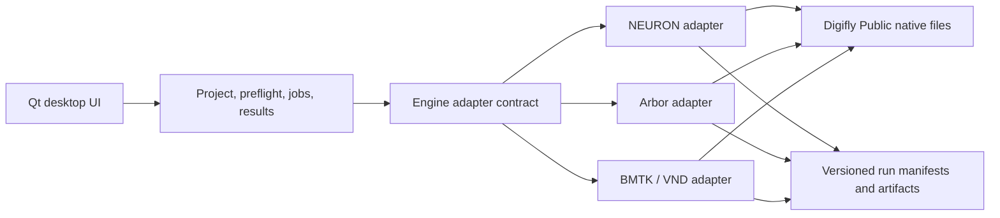

# Architecture

## Design goals

1. Keep Digifly scientific code and source data unchanged.
2. Give every experiment a validated, serializable execution plan.
3. Keep GUI code independent of NEURON, Arbor, BMTK, and VND imports.
4. Launch scientific runtimes out of process so failures do not crash the GUI.
5. Preserve native Digifly inputs and outputs with explicit provenance.

## Layers

The UI never imports a simulator. Adapters discover inputs, build commands,
declare build-time versus runtime-safe fields, and validate results. Commands
are passed as argument arrays rather than shell strings.

## Project format

A `.digifly.json` file contains:

- schema version and project name;
- the selected Digifly workspace and app output root;
- runtime executable paths;
- selected engine/workflow;
- the full experiment configuration;
- timestamps and optional notes.

Run manifests copy the resolved plan, environment overrides, preflight report,
and final exit status. Generated scientific data remains in native formats such
as JSON, CSV, NPZ, HDF5/SONATA, SWC, PNG, and PDF.

## Escape-SIZ boundary

The initial NEURON adapter wraps the existing command-line runner without
editing it. An out-of-process worker rebinds every generated cache/run/plot root
to the configured app output directory while preserving source code, edge data,
SWCs, mutation overlays, and historical summaries as read-only inputs. The
adapter understands the current heterotypic ShakB/GFC2 cache identity, verifies
the deduplicated-visible-contact policy, and loads completed summaries read-only.

## Packaging

PySide6 is the sole GUI dependency. Qt's `pyside6-deploy` can compile a macOS
`.app`, Windows `.exe`, or Linux binary. Simulator environments remain external
and selectable because NEURON, Arbor, BMTK/NEST, TensorFlow, MPI, and VND have
different platform and licensing constraints.
