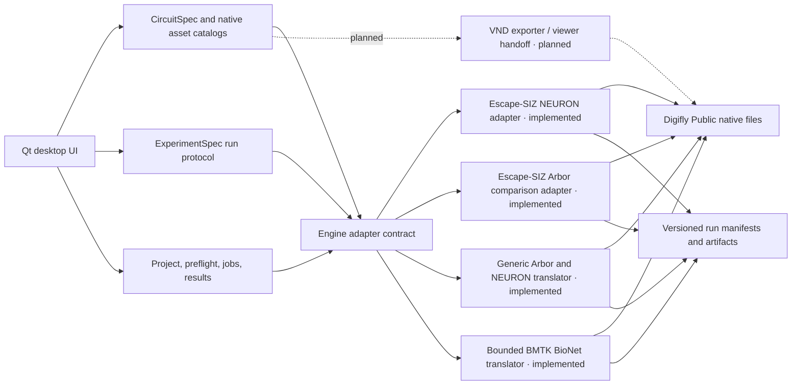

# Architecture

## Design goals

1. Keep Digifly scientific code and source data unchanged.
2. Give every experiment a validated, serializable execution plan.
3. Keep GUI code independent of NEURON, Arbor, BMTK, and VND imports.
4. Launch scientific runtimes out of process so failures do not crash the GUI.
5. Preserve native Digifly inputs and outputs with explicit provenance.

## Layers

The diagram below separates the implemented generic and recipe-specific
execution adapters from planned boundaries. Escape-SIZ has both a NEURON
adapter and a locked 49-cell Arbor Ablation-comparison adapter. Generic
classic-HH Arbor/NEURON translation and a bounded BMTK BioNet translator are
implemented; the VND handoff remains separately gated.

The UI never imports a simulator. The implemented adapters discover inputs,
build commands, declare build-time versus runtime-safe fields, and validate
results. The Escape-SIZ Arbor adapter remains deliberately recipe-specific;
the generic adapter translates supported `CircuitSpec` documents independently.
Commands are passed as argument arrays rather than shell strings.

## Notebook-independent experiment model

`ExperimentSpec` is the run-time counterpart to `CircuitSpec`. Circuit Builder
owns the immutable network design: neurons, morphology assets, membrane
biophysics, and connection intent. Experiment Builder receives a read-only copy
and owns only what changes how that design is run: simulation timing, initial
state, stimulus protocols, control/manipulation conditions, ablations, runtime
mechanism scales, recording requests, random seeds, repetitions, and compute
allocation.

The app-owned pulse-train comparison template translates useful values from the
Escape-SIZ notebooks into this schema, but the schema and UI never import or
execute a notebook. The generic Run action executes supported non-empty selected
classic-HH circuits in Arbor or NEURON with soma current, soma voltage/spike
recording, chemical and electrical condition switches, repetitions, and
app-owned outputs. A bounded BMTK BioNet lane executes morphology-backed
classic-HH cells with selected chemical contacts, soma current clamps, soma voltage, and
spikes. Preflight fails closed for missing/changed edge sources and unsupported
native mechanisms. BMTK additionally rejects electrical contacts, non-soma or
per-compartment mapping, MPI, PointNet, and DPointNet rather than approximating
them. Because valid connectome SWCs can use
non-monotonic node IDs, every worker
records a parent-before-child copy and source-to-run node map in the run folder
so Arbor and NEURON consume the same validated topology. Arbor then constructs
the cable segment tree explicitly and adds a provenance-recorded sub-resolution
root stub because it cannot integrate the SWC root as a zero-length cable; the
source is never rewritten. Both engines resolve the same morphology-aware soma
target policy. Non-finite traces fail the run before a summary or plot can be
accepted.
For multi-cell NEURON, normalized SWC rows are grouped into maximal branch-run
sections with a direct node/site map for imported contacts. Odd `nseg` values
target approximately 40 µm without a silent per-branch cap; a recorded two-
million-total-segment safety limit rejects an oversized circuit explicitly.
The exact app-owned `Gap`, `RectGap`, and `HeteroRectGap` sources are compiled
and load-probed against the selected NEURON interpreter in an external cache.
The BMTK worker materializes run-owned SONATA nodes, chemical edges, type tables,
configuration, and a biological-ID crosswalk. Native BioNet HDF5 voltage and
spike reports are preserved and converted to Digifly's canonical long-form
result tables. Each repetition runs in a fresh child process to isolate NEURON
global state.
The legacy Escape-SIZ adapters remain isolated recipe-specific backends
and result readers; they are no longer a navigation or project-format boundary.

## Backend-unbound circuit-design model

`CircuitSpec` is the proposed boundary between editing and execution. Its nested
schema is version 2; version-1 documents migrate in memory and save back as
version 2 without changing the outer Digifly project envelope. It records a
versioned SWC-source reference, neuron query and resolved IDs, a cable-HH draft,
native membrane-mechanism identity, neuron-level drafts, and per-SWC-node
overrides. Engine
selection is metadata on the project rather than an assumption embedded in the
circuit design. Arbor is the default design target because staged Phase 2
workflows already run and are intended for multicore execution. Default target
selection is not a validation claim: an adapter must capability-check every
mechanism and mapping before producing an execution plan.

Native SWCs are indexed by `ConnectomeCatalog` and parsed into a compact
`Morphology` document. Stable selections use `(neuron_id, SWC child node ID)`;
they do not depend on transient render-actor indices. Custom saves copy the SWC
without changing it and place biophysics/provenance in JSON sidecars.

Membrane mechanisms and classic HH scalars are deliberately separate. The
catalog records the provenance-locked Augustin-2019 GF `nat`, `nap`, and `k`
equations alongside the two Para sodium, four potassium-family, and two
calcium-family Phase 2 mechanisms with their exact NMODL suffixes and portable
source provenance, including a stable catalog ID and exact source SHA-256. A
design can stack mechanisms, preserve disabled values and unexposed advanced
parameters,
and store separate soma/branch densities. Assignment precedence is stable SWC
segment over neuron over cell-set default. An explicit mass-apply action writes
the same neuron-level snapshot to every currently loaded neuron while retaining
narrower segment overrides. Named profiles atomically set both HH and native
mechanism state; any divergent HH or mechanism edit invalidates the profile name
and saves as Custom.

The Augustin GF profile is explicitly GF-specific rather than a universal
fly-neuron default. It distinguishes −65 mV initialization, −85 mV leak
reversal, and the model-predicted −74.670 mV zero-current equilibrium. Paper
workflows consume this app-owned contract and must not reconstruct a partial
"Augustin-like" hybrid by changing only leak reversal or initial voltage.

Gap junctions are connection mechanisms, not membrane channels. `Gap`,
`RectGap`, and `HeteroRectGap` therefore live in a separate all-electrical-edge
policy with direction, placement, conductance basis, and rectification
parameters. Pair-total conductance carries the explicit
`equal_split_across_selected_sites` aggregation rule. Kinetic heterotypic policy
metadata exposes the effective closed floor as the maximum of its closed and
empirical-residual fractions. The policy remains unapplied until connectivity provides two
endpoints. It is excluded from single-neuron bundles so a reusable morphology
can never imply a dangling GJ endpoint.

Version 2 currently has one all-electrical-edge policy. It deliberately does not
claim to encode Escape-SIZ's mixed optional topology: that requires multiple
named edge sets (GF→target imported contacts and GFC2↔GFC2 AIS pairs), endpoint
source hashes, and per-set policies.

## Visualization boundary

The default representation is a GPU-buffered soma-point overview with one
marker per loaded neuron and an explicit **Soma points** / **Full skeletons**
toggle. The Qt-free morphology layer derives ordinary markers from SWC type-1
soma nodes. For MANC DNs, which lack a biological soma in the volume, it honors
Digifly's rostral maximum-Z type-1 pseudosoma convention; native terminal DN
caps and safe fallbacks remain distinguishable as pseudosomata.

The full-skeleton representation stores exact SWC geometry in a spatially
ordered immutable OpenGL vertex buffer, a connected coarse preview for large
overview navigation, and a small dynamic buffer for electric-magenta
compartment highlights. A hierarchical spatial index serves exact deep-zoom
culling, picking, and box selection. Compartment selection and editing remain
full-skeleton operations; selections survive a temporary switch to the point
overview. Framing is representation-aware, using soma-point bounds for the
point view and exact morphology bounds for the skeleton view, whether all cells
or one isolated cell are visible.
The initial orthographic camera basis reproduces the saved VIP GLIA anatomy
orientation used by the Escape-SIZ Ablation comparison notebook. Display mode,
isolation, and culling change only what is drawn and framed, so source geometry
and saved settings remain in the loaded cell set.

## Project format

A schema-v2 `.digifly.json` file contains:

- schema version and project name;
- the selected Digifly workspace and app output root;
- runtime executable paths;
- selected engine/workflow;
- a full circuit document and a separate full experiment document;
- timestamps and optional notes.

Schema-v1 circuit-only projects migrate their former `experiment` payload into
the circuit field. Schema-v1 Escape-SIZ projects migrate reusable timing,
stimulus, and compute values into an `ExperimentSpec`; source data is never
moved during migration.

Run manifests copy the resolved plan, environment overrides, preflight report,
and final exit status. Generated scientific data remains in native formats such
as JSON, CSV, NPZ, HDF5/SONATA, SWC, PNG, and PDF.

## External resource profiles

Machine-local paths are represented by a separate versioned resource profile,
not package defaults or copied data. Typed bindings cover the Digifly Public
workspace, additional morphology/connectome roots, simulator interpreters,
optional VND viewers, the writable output root, and the writable managed-data
root. Every binding has an explicit access intent. Version-1 profiles migrate
in memory without moving any binding; an explicit command writes a separate
version-2 file. Validation is fail-closed when either writable root resolves
inside a read-only scientific source or the writable roots contain one another.

Local managed imports are copied under `data/imports/<provider>/<id>/<version>`.
Workstation inventories the selected source, rejects symlinks and non-regular
entries, checks available space, copies into `data/.staging`, hashes every file,
runs the adaptive SWC audit, writes a provider-neutral manifest, and atomically
renames the completed bundle into place. Only a promoted bundle is registered
as a morphology provider. User-managed folders remain a separate read-only,
no-copy registration path.

neuPrint acquisitions use a deterministic request digest under `.staging`
that excludes tokens and credential references. Each completed SWC and optional
selected-to-selected connectivity CSV is recorded with its size and SHA-256 in
an atomically replaced checkpoint. A retry validates those files before
skipping their network requests. Only after every requested artifact, metadata,
quality result, and final manifest is complete is the checkpoint directory
promoted and registered; morphology and connectivity receive distinct typed
read-only bindings.

Computational models use typed `model_source` bindings and live under
`data/modeldb/<accession>/<version>` or
`data/models/local/<id>/<version>`. Folder and ZIP/TAR intake is preflighted for
bounded regular files and portable contained paths, then copied/extracted
without executing model code. The manifest records simulator signatures,
mechanisms, entry-point candidates, README/license presence, citations,
checksums, and an explicit `execution_performed: false`. A bundle containing
SWCs also receives a read-only morphology binding so the existing provider and
quality-review paths can consume it.

All remote providers share a bounded deterministic retry policy. Only transient
transport failures and the explicitly retryable HTTP status set are retried;
authentication, not-found, malformed-response, unsafe-redirect, and integrity
failures are terminal. Backoff is cancellation-aware and capped. neuPrint
applies this policy to discovery, preview, skeleton, and connectivity requests.
ModelDB applies it to metadata, archive discovery, and archive transfer.

ModelDB archive transfer uses a receipt-backed `.part` file beside the requested
destination. A matching receipt can resume with `Range` and `If-Range`; response
length, range, validator, origin, and compressed-size limits are validated on
every attempt. A complete ZIP is promoted with a no-clobber filesystem
operation. Folder files are content-hashed during preflight and compared while
copied. Archives are hashed during preflight and checked before and after
extraction and while preserving the original, closing the inspection/import
time-of-check gap.

Managed bundle verification is a separate cancellable backend operation with
byte/file progress. It validates contained portable paths, case-insensitive
uniqueness, symbolic-link exclusion, regular-file identity, declared sizes and
SHA-256 values, plus manifest file/byte totals. Detailed stability and change
control are frozen in `BACKEND_CONTRACT_V1.md`.

Managed-resource lifecycle operations use the manifest as their identity and
transaction boundary. Registration adds only read-only typed bindings;
unregistration replaces active provider bindings with an inactive catalog
record containing their exact definitions, without touching data. Soft removal
uses a same-library atomic rename into `data/.trash`, records the original relative
root and exact prior bindings, and rolls the move back if profile persistence
fails. Restore reverses the move and reinstates those bindings. Whole-library
relinking assumes the user has already moved the directory, verifies every
managed binding and manifest at the equivalent relative path, checks profile
boundaries, and only then atomically rewrites the machine-local profile.
An app-managed move uses that same relink validator after either an atomic
same-filesystem rename or a complete cross-filesystem copy whose files are
reread and SHA-256 verified. The cross-filesystem source is removed only after
the new profile is durable. Permanent deletion is limited to one validated
direct child of `.trash` and rejects symbolic-link roots or entries.

Provider adapters translate registered morphology roots into ordinary
`ConnectomeRef` records without crawling or copying them. The existing Digifly
Public discovery path remains compatible; explicit providers are indexed only
after a user selects the source.

## Simulator runtime onboarding

NEURON, Arbor, and BMTK remain external dependencies and may use distinct Python
interpreters. The BMTK binding is usable only when BMTK, NEURON, NumPy, and `h5py`
coexist in that one selected interpreter. Workstation links to the official
[NEURON installation guide](https://nrn.readthedocs.io/en/latest/index.html#installation)
and [Arbor Python installation guide](https://docs.arbor-sim.org/en/latest/install/python.html),
plus the [BMTK installation guide](https://alleninstitute.github.io/bmtk/installation.html).
Runtime discovery never begins implicitly: the user first approves a dialog
that names the bounded search locations and actions. The search reads PATH and
immediate children of common Conda/virtual-environment roots, launches each
candidate Python with a sanitized environment, and checks module/package
metadata without importing simulator modules into the GUI. The user reviews
exact interpreter paths and versions before the selected NEURON, Arbor, and
BMTK bindings are written to the machine-local v2 profile. The probe sanitizes
inherited Python paths and marks BMTK unavailable unless BioNet can import its
NEURON, NumPy, and HDF5 dependencies from the same interpreter.

## Escape-SIZ boundary

The initial NEURON adapter wraps the existing command-line runner without
editing it. An out-of-process worker rebinds every generated cache/run/plot root
to the configured app output directory while preserving source code, edge data,
SWCs, mutation overlays, and historical summaries as read-only inputs. The
adapter understands the current heterotypic ShakB/GFC2 cache identity, verifies
the deduplicated-visible-contact policy, and loads completed summaries read-only.

The dedicated Arbor adapter locks the active Ablation-notebook comparison to 49
cells, 11 GFC2 stimuli, 2.5× GF contact-site sodium, 2,331 retained chemical
rows after direct-GF removal, and 959 gap contacts. Its app-owned worker writes
filtered inputs, plans, simulations, metrics, plots, and provenance outside
`Digifly Public`. Gap-enabled and gap-disabled conditions share the same locked
input contract.

The app owns NMODL source ports for `Gap`, `RectGap`, and `HeteroRectGap`. A
compiled `digifly_gap` catalogue is tied to Arbor 0.12.2 and the active
compiler/platform ABI. Preflight validates its manifest, hash, mechanism kinds,
and parameter schemas by loading it in the selected external Arbor runtime. The
catalogue is cached beneath the app output root in
`_runtime/arbor_catalogues/<ABI-key>`; it is not copied into or generated inside
`Digifly Public`.

At worker startup, a fail-closed bridge extends every fresh Arbor cable-property
catalogue under the `digifly_` prefix and replaces only the staged runner's
junction factory. The runner's connection weight remains 1.0. A load, schema,
version, or hook mismatch aborts the run; there is no fallback to built-in
`gj`.

## Engine capability boundary

Four curated staged Phase 2 Arbor scenarios pass archived compact-NEURON
comparison baselines using built-in HH/passive, `exp2syn`, and ohmic `gj`.
Separately, the app-owned catalogue now provides equation-level Arbor ports of
`Gap`, `RectGap`, and `HeteroRectGap` for the dedicated Escape-SIZ comparison.
For `HeteroRectGap`, the voltage-dependent gate, residual floor, endpoint
orientation, and opening/closing equations and parameters are represented.
Arbor uses `cnexp` for the gate state while NEURON's source uses
`derivimplicit`, so finite-step trajectories are not asserted to be bitwise
identical. The first empirical 49-cell audit completed with catalogue,
implementation, placement, and provenance checks passing, but its overall
verdict is `NOT_YET_EQUIVALENT`. The required gap-disabled source-readiness gate
passes 0 of 11 stimulated somas. The app includes a fail-closed translation
of legacy grouped-section boundaries plus the native soma-site clamp for
diagnostic use only. It is a compatibility candidate, not a topology-
equivalence claim, because Arbor adds zero-area fork CVs and the staged
morphology retains a tiny root stub. A four-thread 49-cell diagnostic with that
explicit policy exited in native Arbor with `SIGBUS`. The cause was a deeply
recursive n-ary boundary locset; the bridge now constructs an equivalent
balanced binary locset, which preserved all tested CV parent/cable signatures
and completed an 11-source four-thread construction A/B. It nevertheless stays
quarantined to bounded, single-thread diagnostics and is not installed by the
production worker. A full 49-cell four-thread 0.02 ms construction/run probe
also completed, but the complete 5 ms threaded diagnostic is not yet
requalified.
Production stays on the completed `every_segment` path. The one-thread 49-cell
source diagnostic completed but passed 0 of 11 traces after NEURON was linearly
sampled onto Arbor's dense epoch-relative grid, so the upstream absolute-voltage
mismatch must be resolved before another full audit.

This recipe-specific bridge does not validate the other Phase 2 NMODL/Drosophila
membrane channels. Generic Arbor and NEURON execution independently translates
supported selected-cell classic-HH designs; NEURON uses exact app-owned `Gap`,
`RectGap`, and `HeteroRectGap` mechanisms for validated electrical contacts.
The bounded BMTK translator uses real BioNet/SONATA for morphology-backed
classic-HH cells, selected chemical contacts, and soma clamp/voltage/spikes.
Electrical contacts, native mechanisms, non-soma/per-compartment mapping, MPI,
PointNet, and DPointNet remain blocked rather than silently mapped. VND is a
visualization/export consumer, not a simulator.

## Packaging

PySide6 is the sole GUI dependency. Qt's `pyside6-deploy` can compile a macOS
`.app`, Windows `.exe`, or Linux binary. Simulator environments remain external
and selectable because NEURON, Arbor, BMTK/NEST, TensorFlow, MPI, and VND have
different platform and licensing constraints.
