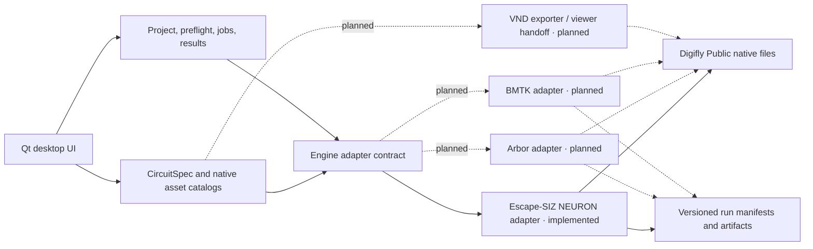

# Architecture

## Design goals

1. Keep Digifly scientific code and source data unchanged.
2. Give every experiment a validated, serializable execution plan.
3. Keep GUI code independent of NEURON, Arbor, BMTK, and VND imports.
4. Launch scientific runtimes out of process so failures do not crash the GUI.
5. Preserve native Digifly inputs and outputs with explicit provenance.

## Layers

The diagram below is the target adapter architecture. Only the Escape-SIZ
NEURON execution adapter is implemented today; the Arbor, BMTK, and VND nodes
are planned boundaries.

The UI never imports a simulator. The implemented Escape-SIZ adapter discovers
inputs, translates supported fields from backend-unbound drafts, builds
commands, declares build-time versus runtime-safe fields, and validates
results. Future adapters must satisfy the same contract. Commands are passed as
argument arrays rather than shell strings.

## Backend-unbound circuit-design model

`CircuitSpec` is the proposed boundary between editing and execution. It records a
versioned SWC-source reference, neuron query and resolved IDs, a cable-HH draft,
neuron-level drafts, and per-SWC-node overrides. Engine
selection is metadata on the project rather than an assumption embedded in the
circuit design. Arbor is the default design target because staged Phase 2
workflows already run and are intended for multicore execution. Default target
selection is not a validation claim: an adapter must capability-check every
mechanism and mapping before producing an execution plan.

Native SWCs are indexed by `ConnectomeCatalog` and parsed into a compact
`Morphology` document. Stable selections use `(neuron_id, SWC child node ID)`;
they do not depend on transient render-actor indices. Custom saves copy the SWC
without changing it and place biophysics/provenance in JSON sidecars.

## Visualization boundary

The Circuit Builder uses one immutable OpenGL vertex buffer for all loaded SWC
segments and a small dynamic buffer for highlighted selections. Camera state
and CPU-assisted picking stay in the GUI layer; circuit and morphology models
have no Qt dependency. The initial orthographic camera basis reproduces the
saved VIP GLIA anatomy orientation used by the Escape-SIZ Ablation comparison
notebook. Isolation changes only which vertex ranges are drawn, so hidden
neurons and their saved settings remain in the loaded cell set.

## Project format

A `.digifly.json` file contains:

- schema version and project name;
- the selected Digifly workspace and app output root;
- runtime executable paths;
- selected engine/workflow;
- the full experiment configuration;
- timestamps and optional notes.

Run manifests copy the resolved plan, environment overrides, preflight report,
and final exit status. Generated scientific data remains in native formats such
as JSON, CSV, NPZ, HDF5/SONATA, SWC, PNG, and PDF.

## Escape-SIZ boundary

The initial NEURON adapter wraps the existing command-line runner without
editing it. An out-of-process worker rebinds every generated cache/run/plot root
to the configured app output directory while preserving source code, edge data,
SWCs, mutation overlays, and historical summaries as read-only inputs. The
adapter understands the current heterotypic ShakB/GFC2 cache identity, verifies
the deduplicated-visible-contact policy, and loads completed summaries read-only.

## Engine capability boundary

Four curated staged Phase 2 Arbor scenarios pass archived compact-NEURON
comparison baselines using built-in HH/passive, `exp2syn`, and ohmic `gj`.
NEURON remains the reference implementation lane for established Phase 2
NMODL/Drosophila channels and true heterotypic rectification. BMTK
PointNet/DPointNet are LIF/GLIF lanes and
do not consume the current cable-HH draft; a generic BioNet translator is future
work. VND is a visualization/export consumer, not a simulator.

## Packaging

PySide6 is the sole GUI dependency. Qt's `pyside6-deploy` can compile a macOS
`.app`, Windows `.exe`, or Linux binary. Simulator environments remain external
and selectable because NEURON, Arbor, BMTK/NEST, TensorFlow, MPI, and VND have
different platform and licensing constraints.
